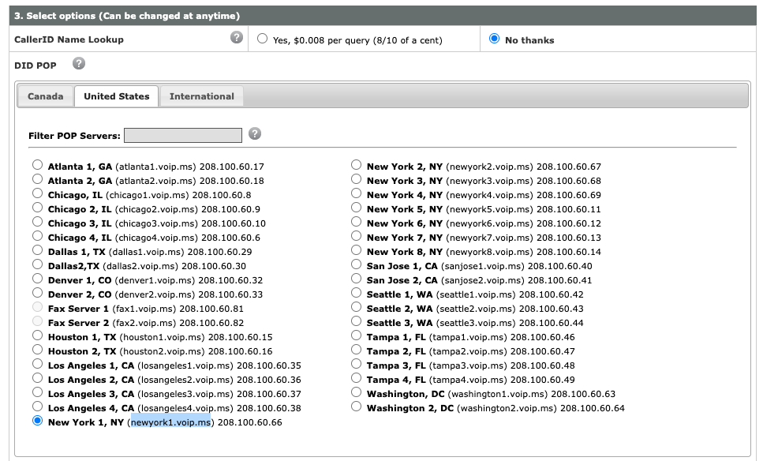

# How to get a phone number from voip.ms

## What is voip.ms?

[voip.ms](https://voip.ms/en/invite/NTE5MTQy) is a BYOD (Bring Your Own Device) phone service provider.

A phone line cost ~$1/month.

## Create an account

Detailled instructions for [how to get started with voip.ms](https://wiki.voip.ms/article/Getting_Started).

- Create account:

- Add a minimum of $15 to your account:

### Order a number

Detailled instructions for [ordering a phone number](https://wiki.voip.ms/article/Order_a_DID_Number).

- Order DID (Direct Inward Dialing) number:

- Choose number: You can search for the number you'd like. In NY state, ratecenters NWYRCYZNxx are Manhattan

- Choose plan: Unless you plan to use your landline more than 7 hours per month, I would recommend the `Per Minute Plan`. 

- Choose server: `newyork1.voip.ms`

### Get your SIP Username and SIP password

- Get your user and password in [Account Settings](https://www.voip.ms/m/settings.php): user name is composed of 6 digits.

## Devices?

If you don't have a phone device yet, check these 2 options:

- [Rotary phone](rotary.md)
- [Wireless phone](wifi_ip_phone.md)
